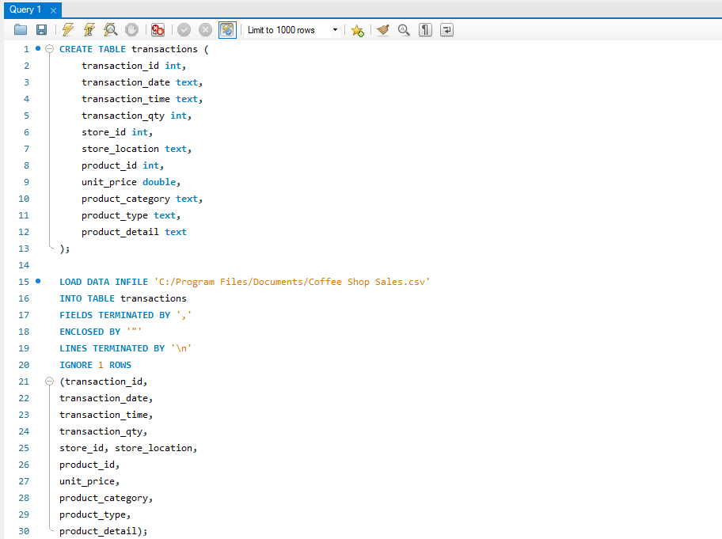
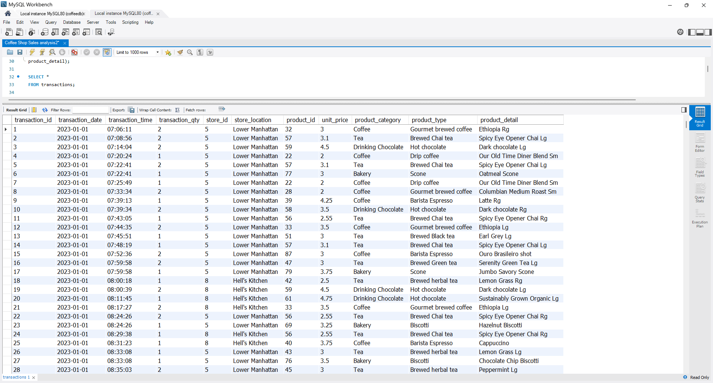

# Coffee Shop Sales Analysis Using SQL
## INTROUCTION
In today’s competitive business landscape, understanding customer preferences is vital for sustaining success. Data provides invaluable insights into customer behaviour, enabling businesses to anticipate needs and tailor their strategies accordingly. This analysis explores key performance metrics such as sales trends, location effectiveness, and product performance. By utilising SQL to query data from a coffee shop database, we aim to uncover actionable insights that can drive informed decision-making.

## ABOUT THE DATA AND TOOLS
The dataset used for this analysis was sourced from Kaggle. It contains over 149,000 transactions recorded during the first half of 2023 across three store locations. With such a comprehensive dataset, there is ample scope to study consumer habits and derive meaningful insights. The columns of the dataset are as follows:
- **`transaction_id`**: Unique sequential ID representing an individual transaction.  
- **`transaction_date`**: Date of the transaction (MM/DD/YY).  
- **`transaction_time`**: Timestamp of the transaction (HH:MM:SS).  
- **`transaction_qty`**: Quantity of items sold.  
- **`store_id`**: Unique ID of the coffee shop where the transaction took place.  
- **`store_location`**: Location of the coffee shop where the transaction took place.  
- **`product_id`**: Unique ID of the product sold.  
- **`unit_price`**: Retail price of the product sold.  
- **`product_category`**: Description of the product category.  
- **`product_type`**: Description of the product type.  
- **`product_detail`**: Description of the product detail.  
The analysis was conducted using:
- **`MySQL`** for querying and data manipulation.
- **`Excel`** was utilised for creating visual representations of the findings through charts.

## DATA PREPARATION
The first step involved creating a table within the coffee shop database to house the dataset. Once the table was established, the dataset was loaded into it to enable efficient querying and analysis.

