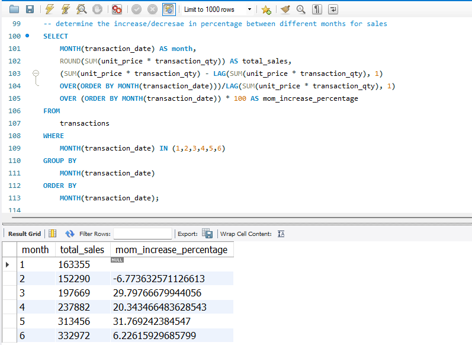
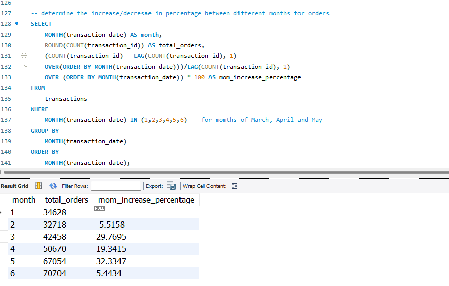
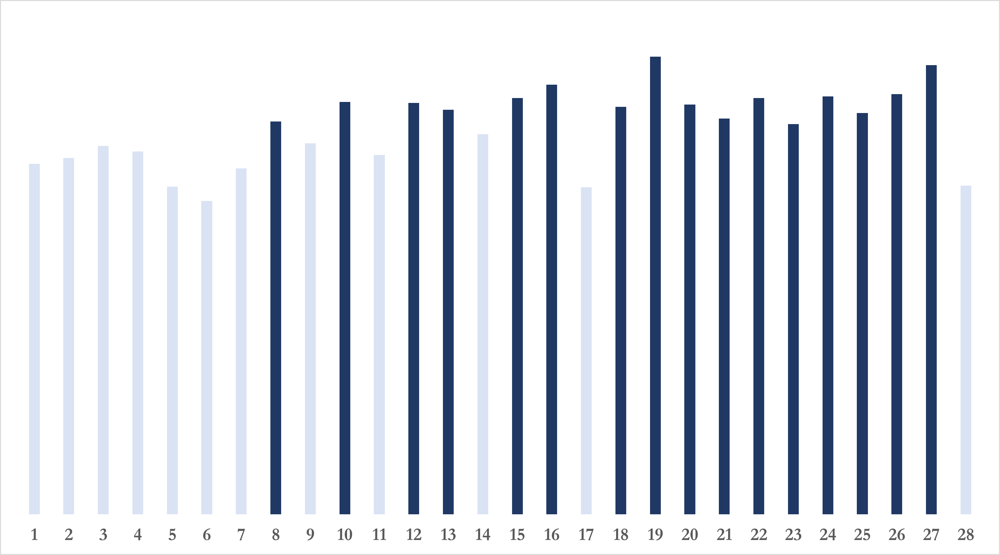
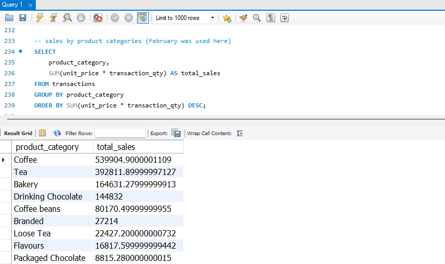

# Coffee Shop Sales Analysis Using SQL
## INTROUCTION
In today’s competitive business landscape, understanding customer preferences is vital for sustaining success. Data provides invaluable insights into customer behaviour, enabling businesses to anticipate needs and tailor their strategies accordingly. This analysis explores key performance metrics such as sales trends, location effectiveness, and product performance. By utilising SQL to query data from a coffee shop database, we aim to uncover actionable insights that can drive informed decision-making.

## ABOUT THE DATA AND TOOLS
The dataset used for this analysis was sourced from Kaggle. It contains over 149,000 transactions recorded during the first half of 2023 across three store locations. With such a comprehensive dataset, there is ample scope to study consumer habits and derive meaningful insights. The columns of the dataset are as follows:
- **`transaction_id`**: Unique sequential ID representing an individual transaction.  
- **`transaction_date`**: Date of the transaction (MM/DD/YY).  
- **`transaction_time`**: Timestamp of the transaction (HH:MM:SS).  
- **`transaction_qty`**: Quantity of items sold.  
- **`store_id`**: Unique ID of the coffee shop where the transaction took place.  
- **`store_location`**: Location of the coffee shop where the transaction took place.  
- **`product_id`**: Unique ID of the product sold.  
- **`unit_price`**: Retail price of the product sold.  
- **`product_category`**: Description of the product category.  
- **`product_type`**: Description of the product type.  
- **`product_detail`**: Description of the product detail.  
The analysis was conducted using:
- **`MySQL`** for querying and data manipulation.
- **`Excel`** was utilised for creating visual representations of the findings through charts.

## DATA PREPARATION
The first step involved creating a table within the coffee shop database to house the dataset. Once the table was established, the dataset was loaded into it to enable efficient querying and analysis.

**Here is the loaded table**

Upon examining the data structure, it was observed that certain columns, such as transaction_date and transaction_time, did not have the appropriate data types. These issues will be addressed in the next section to ensure accurate analysis.

## DATA CLEANING
## Data Structure: 
To ensure consistency and accuracy in our analysis, the data types of the transaction_date and transaction_time columns were modified. The transaction_date column was converted from “text” to “date”, and the transaction_time column was converted from “text” to “time”. These changes provide the necessary structure for performing time-based queries effectively.

## Null Values: 
Missing values can significantly impact the reliability of our analysis. Although the initial inspection indicated no null values across the dataset, we conducted a secondary check to ensure accuracy. Focusing on the primary columns required for our analysis, we verified the presence of any missing values. The result confirmed that there were “0” missing entries, ensuring that the dataset is complete and ready for analysis.

## Irrelevant Columns:
While it is possible to proceed with the analysis without modifying the dataset, certain columns may not add value to the objectives of the study. In this case, the “product_detail” column was deemed unnecessary as it did not contribute to any specific metric or insight generated during the analysis. Consequently, the column was dropped to streamline the dataset and enhance its relevance. The updated dataset now excludes the “product_detail” column, ensuring that only pertinent information is retained for further exploration.

With the dataset now cleaned and optimised for analysis, we can proceed to explore the key metrics and insights that will provide a deeper understanding of sales trends, location performance, and customer preferences. The following sections will detail the SQL queries used, the results obtained, and the interpretations of these findings.

## DATA EXPLORATION AND ANALYSIS
## Key Performance Indicators (KPIs):
To begin our analysis, we aim to compute essential Key Performance Indicators (KPIs) that will provide an overview of the business’s performance throughout the first half of 2023. These KPIs include total sales, quantity sold, and the number of orders placed between January and June 2023.

From the analysis above, it can be seen that the coffee shop received nearly 300,000 orders during the first half of 2023. This resulted in the sale of over 400,000 units of products, generating a total revenue of $1,397,600.

## Sales by Month:
To gain a deeper understanding of how the coffee shop’s sales fluctuate over the months, we analyze the sales data on a month-by-month basis. This analysis provides insights into seasonal trends and can help identify months with higher or lower sales performance, enabling the business to adjust its strategies accordingly.  
*Note: Months are represented numerically, where 1 corresponds to January, 2 to February, and so on.*

**Here is a visual representation**

From the table and corresponding chart, it is evident that there is a consistent upward trend in sales across the months, with the exception of February, where sales experienced a decline. This observation suggests that the company is on a growth trajectory.  

To further analyze this, we calculated the month-on-month change in sales as a percentage. As previously mentioned, only February recorded a negative change. Notably, May experienced the most significant growth, with a remarkable increase of 31.77%.

## Orders by Month:
What is the total number of orders recorded each month?
To determine the number of orders placed each month, we grouped the data by the month of the transaction date and counted the total number of unique orders.

The result from the above correlates with the analysis for sales. There is generally an increase in orders every month except for February. There is no much difference in percentage change in orders compared to that of sales. Infact, for March it was almost identical percentage (29.7777 and 29.7695). 

## Quantity Sold by Month:
What is the total number of quantity sold each month?
 
Similar to the sales data, the number of quantity sold follows a comparable growth pattern. This observation suggests a strong correlation between sales, orders, and quantity sold. As both the quantity of products sold and the number of orders increase, sales show a consistent upward trend. This indicates that higher customer engagement, reflected in more orders and higher sales volume, contributes directly to the overall revenue growth.

## Sales by Weekday vs Weekend:
How do sales on weekends compare to those on weekdays?

**Here is a visual representation**

A substantial 28% of sales are generated on weekends. This indicates that the company should not become complacent during this period, as a significant portion of its revenue is derived from weekend transactions.

## Sales by Store Location:
Which store is performing the best among the three?

**Here is a visual representation**

Each of the stores performed admirably, generating over $460,000 in sales, with Hell’s Kitchen leading the pack at $473,020. This indicates that the management is implementing effective strategies that are driving overall positive change across all locations.

## Daily Performance:
How do sales on specific days compare to the average sales for the period?  
For this analysis, we selected February, calculated the average sales for the month, and then evaluated the sales for each day. This allowed us to identify days where sales fell below the monthly average.

**Here is the daily average for February**

**Here is a visual representation**

As shown in the first image, the average sales for the month of February was $5,400. In the second image, the first instance of sales exceeding this average occurred on the 8th day. However, by the end of February, which had a total of 28 days, more than 50% (16 days) had sales above the average. This indicates that while February started off slowly, sales picked up significantly after the first two weeks.

## Product category and type ranking:
Which products are performing well, and which ones are underperforming?  
In this section, we assess the performance of different product categories and types. By ranking them based on their sales, we can identify which products are driving revenue and which may need attention. This analysis helps to understand customer preferences and optimize inventory management and marketing efforts accordingly.

Coffee and Tea categories lead in sales, contributing to over 50% of total revenue. In contrast, Packaged Chocolate, with just under $9,000 in sales, ranks as the least performing category. To gain deeper insights, we further examined the product types within the top-performing categories to determine which specific items are driving the highest sales. This deeper analysis allows us to pinpoint the most popular products and understand consumer preferences more clearly.

Given the insights derived from the product category ranking, the product ranking table appears consistent, with one notable exception: “Drinking Chocolate,” which was not part of the top two categories, produced a “Hot Chocolate” product that ranked in the top 3 out of 60 products. This suggests a viable market for drinking chocolate. Therefore, the company should consider expanding its offerings in this category, as Hot Chocolate remains the only chocolate-related product currently available. Expanding this product line could capitalize on an emerging consumer interest and drive additional sales.

## Customer traffic:
What time of the day do customers visit the shop?  
To determine the peak times for customer visits, we analyzed the times at which orders were recorded. Understanding when customers tend to visit the shop is crucial, as it enables management to strategically allocate sufficient and well-trained staff during peak periods. This ensures that customers are attended to promptly, improving service efficiency and customer satisfaction.

**Here is a visual representation**

From the analysis, it is evident that orders peak between 7 AM and 10 AM. The highest traffic occurs at 10 AM, after which it begins to decrease gradually, stabilising at a certain level before hitting its lowest point around 8 PM.  
Similarly, I also examined the performance across different days of the week to identify which days experience the highest levels of customer traffic.

**Here is a visual representation**

Based on the analysis, Friday recorded the highest number of orders, while Saturday saw the lowest.

## INSIGHTS AND RECOMMENDATIONS
**1.	Do not Neglect Weekend Sales:**
Since a significant 28% of sales come from weekends, it’s essential for the management not to overlook weekend performance. They should ensure that customer service is optimal during this period by staffing appropriately and possibly offering promotions or events to further boost sales on weekends. 
**2. Monitor Sales Fluctuations by Month:**
Although sales have generally increased over the months, February showed a dip in performance. It is important to analyse this decline and identify any seasonal factors or marketing gaps that might have contributed to this drop. Adjusting marketing campaigns or promotions for February could help mitigate such issues in the future. 
**3. Capitalize on Peak Hours:**
Orders are highest between 7 AM and 10 AM, suggesting that customers are more likely to visit during this time. Ensuring that staffing levels are at their peak during these hours will help meet demand and improve customer satisfaction. Offering time-specific promotions or loyalty rewards could also be an effective strategy during this peak period. 
**4. Optimize Product Offerings:**
Coffee and Tea are the top-performing products, contributing significantly to total sales. Management should consider expanding the variety within these categories to cater to customer preferences. Additionally, “hot chocolate” emerged as a popular item within the lesser-performing category of “drinking chocolate.” This presents an opportunity to introduce more chocolate-based products, as there appears to be market demand. 
**5. Improve Product Availability During Peak Days:**
Fridays are the busiest days, and sales tend to peak then. The management should ensure that stock levels are sufficient, and the right products are available for customers on Fridays. Promotions or special deals could be introduced on Fridays to further drive traffic. 
**6. Location-Specific Strategy:**
While all three store locations performed well, Hell’s Kitchen was the top performer. The success at this location could be studied to understand the factors that contribute to its performance, such as product offerings, customer service, or local marketing efforts. The management could replicate these best practices at other locations. 
**7. Leverage Insights from Customer Traffic:**
Since customer traffic drops after 10 AM and reaches its lowest at 8 PM, the shop should consider adjusting staffing and operations accordingly. For instance, focusing on offering promotions or targeting new customer segments during off-peak hours might help balance traffic and increase sales during these quieter times. 
**8. Enhance Marketing Strategies Based on Day of the Week:**
Saturdays tend to see lower order volumes. Management could experiment with special offers or events targeted at boosting Saturday sales, such as offering discounts, live events, or weekend-only menu items to attract customers. 
**9. Increase Order Efficiency:**
With almost 300,000 orders placed, operational efficiency is key. Management should focus on enhancing the ordering process, perhaps by introducing new technologies (e.g., mobile ordering, self-service kiosks), to ensure quick and accurate order fulfillment, especially during peak hours. 
By acting on these recommendations, the coffee shop can increase its sales, optimize operations, and improve customer satisfaction across all locations.
___________________________________________________________________________________________________
Thank you for reading. I hope you find this insightful. 
